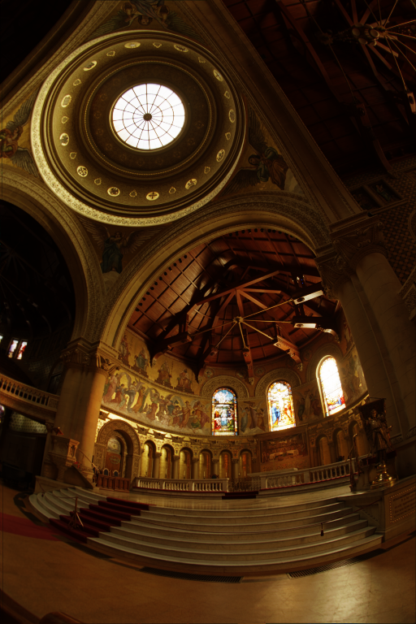
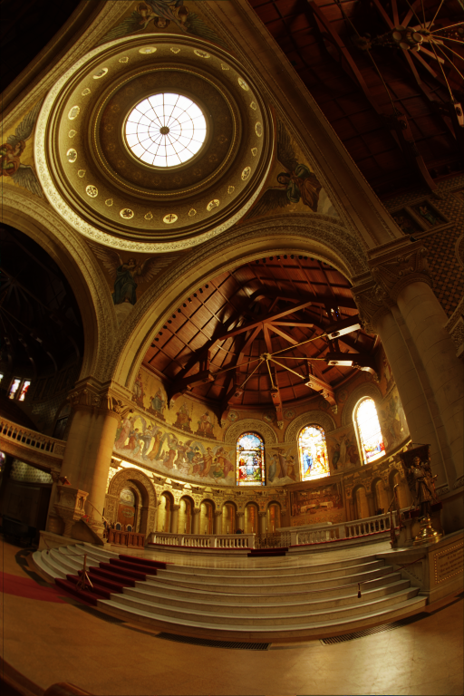
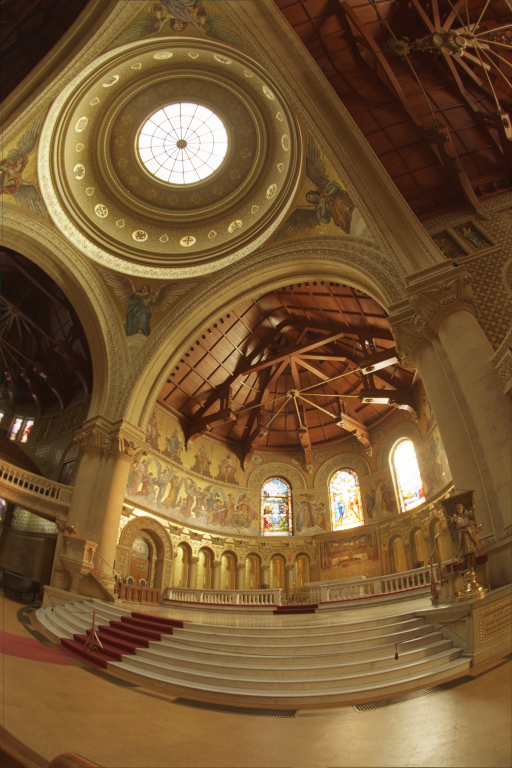
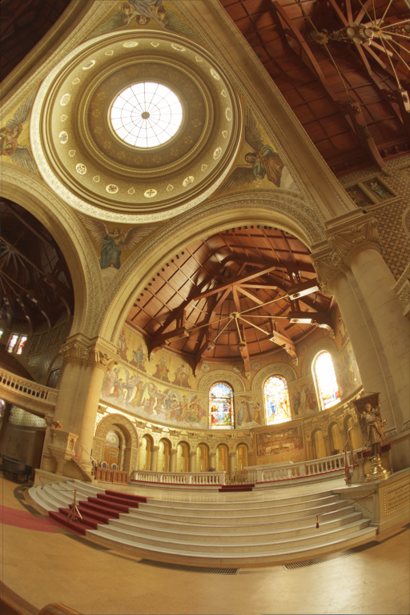
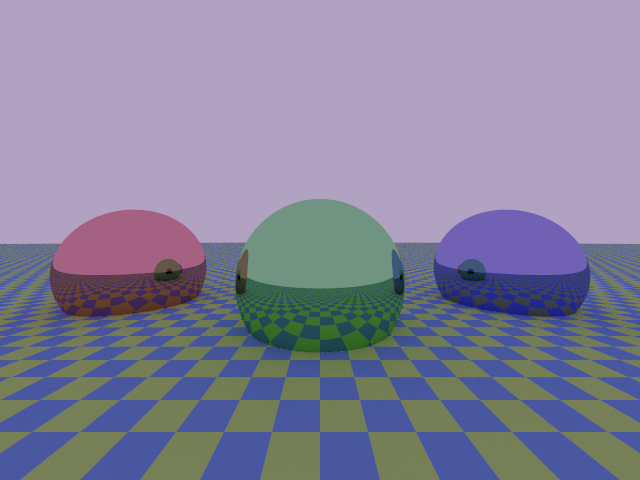
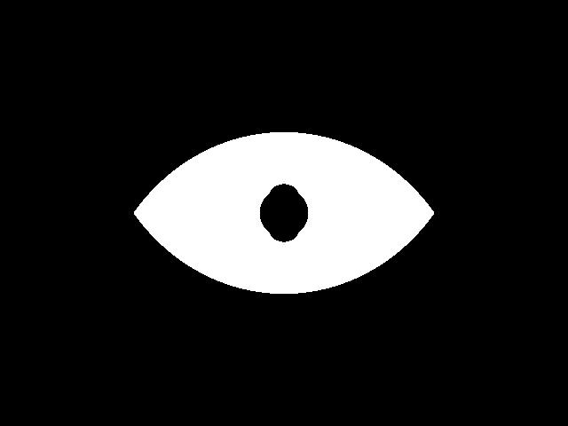
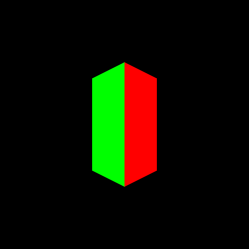

# v0.2.0

With this program, you can read PFM files and convert them to PNG files performing, if necessary, tone mapping and gamma correction. Moreover, form this version on, you can produce a geometric image using a ray-tracing algorithm and save it both as a PFM and PNG file.

## Installation

The code is written in Nim, it has been tested with stable and devel Nim versions from 2.0.2 on with Ubuntu 22.04.4 or higher.

To use it, the installation of the [nim-simplepng](https://github.com/jrenner/nim-simplepng) and [cligen](https://github.com/c-blake/cligen) libraries is required. The installation through [nimble](https://github.com/nim-lang/nimble) package manager is advised. Therefore, you can simply run:

    nimble install <LIBRARY_NAME>

## Basic usage with examples

### General indications

To run the program you can either compile and run it in a single line using

    nimble run project <COMMAND> <ARGUMENTS>

or compile it with

    nimble build

and then run it through

    ./project <COMMAND> <ARGUMENTS>

Two commands are available: `pfm2png` and `demo`. Keep reading to learn about them or run

    nimble run project <COMMAND> -h

for a quick guide.

### Converter

To use this program to convert an `INPUT_PFM_FILE` to an `OUTPUT_PNG_FILE` run  

    nimble run project pfm2png <INPUT_PFM_FILE> <OUTPUT_PNG_FILE>
    
To perform tone mapping and/or gamma correction during the conversion, you can specify `<GAMMA>` and/or `<A_VALUE>` using:

    nimble run project pfm2png -a=<A_VALUE> -g=<GAMMA> <INPUT_PFM_FILE> <OUTPUT_PNG_FILE>

These are optional arguments so you can either specify them both, just one of them or none of them as in the previous case.

Here are some example of the conversion of the file `memorial.pfm` using different values of `<GAMMA>` and `<A_VALUE>`.

<table style="margin: 0px auto;">
    <tr>
        <td> 
            
            
A_VALUE=0.15  GAMMA=1.0
 
        </td>
        <td> 
            
            
A_VALUE=0.25  GAMMA=1.0

        </td>
    </tr>
    <tr>
        <td> 
            
            
A_VALUE=0.15  GAMMA=2.0

        </td>
        <td> 
            
            
A_VALUE=0.25  GAMMA=2.0

        </td>
    </tr>
</table>

### Production of demo image

To use this program as a ray-tracer and produce a demo image run

    nimble run project demo <INPUT_PFM_FILE> <OUTPUT_PNG_FILE>

As in the previous case, it is possible to add some optional arguments to the command to adjust some aspects of the generated image. 
- `-a=<A_VALUE>` and `-g=<GAMMA>` can be used as explained above;
- `-k='o'` changes the camera used to generate the image from a perspective one (default or `-k='p'`) to an orthogonal one;
- `-w=<WIDTH>` and `--height=<HEIGHT>` allows you to decide the dimension of the generated image using an integer number of pixells for each length, default values are 640 and 480 respectively;
- `--angle=<ANGLE>` set the angle (expressed in degrees) from which the camera looks at the scene, default is 0.

Here is the default demo image produced:

### Production of demo animation

With this code it is also possible to produce an animation which shows the demo image as if the camera rotates around the scene. For this, just run the bash script that you find in the present directory using

    sh demo_animation.sh

Press play to see the output you should be able to get

<video width="320" height="240" controls>
  <source src="examples/spheres-perspective.mp4" type="video/mp4">
</video>

## Advanced usage

If you are a skilled user, by properly changing `demo()` and `OnOffTracer()` procs in [project.nim](./src/project.nim), you can produce many other images. To give you an idea about what is feasible with this program, here is a selection to inspire you.

<table style="margin: 0px auto;">
    <tr>
        <td> 
            
        </td>
        <td> 
            
        </td>
        <td> 
            
        </td>
    </tr>
</table>

## License

The code is released under the GPL3 License. See the file [LICENSE.md](./LICENSE.md) for more information.