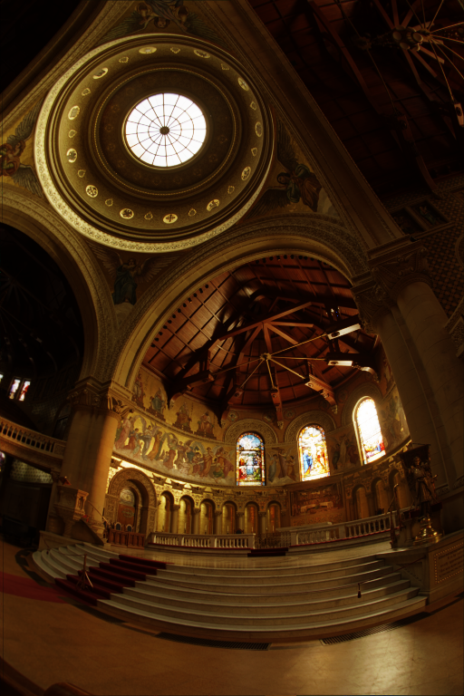
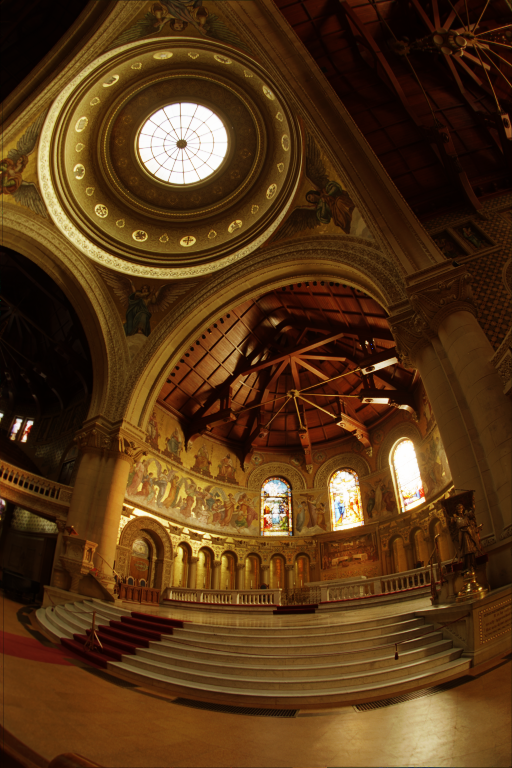
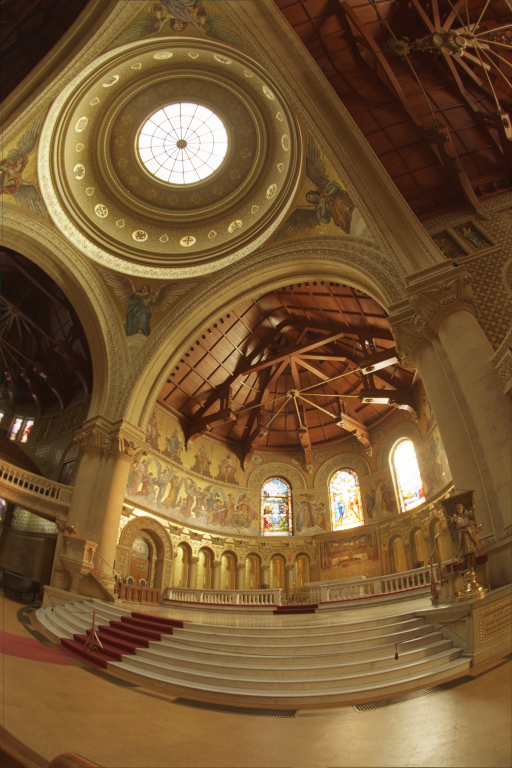
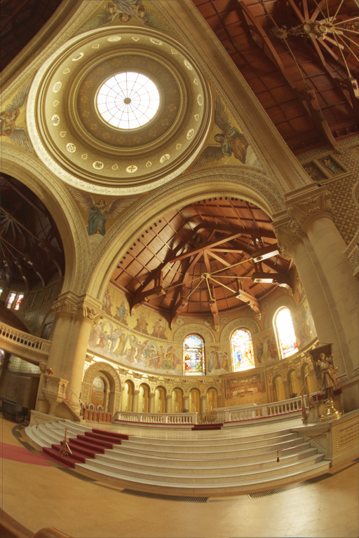
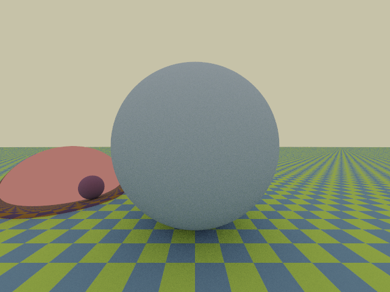
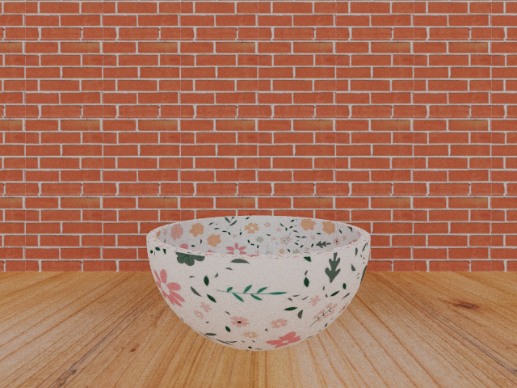
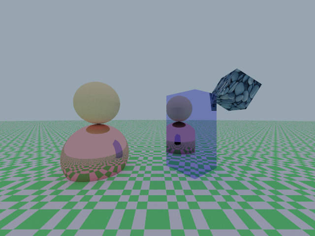
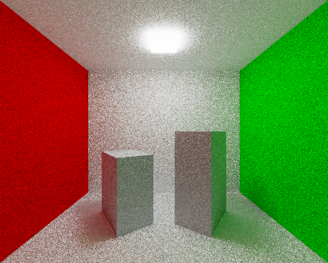
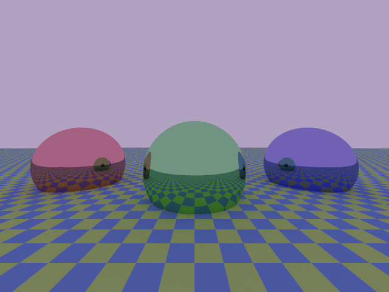
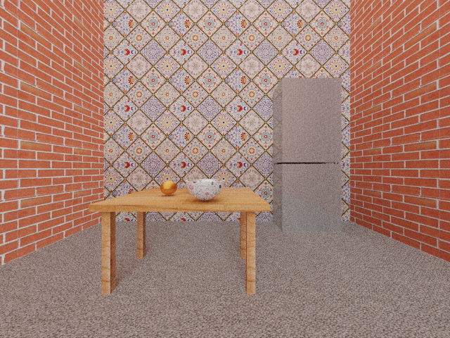

# v1.0.0

This program is a first look into rendering. It can produce images using different rendering algorithms, like the path tracer. Since the program output is a PNG image and a PFM file, it can also works as a PFM to PNG converter, performing tone mapping and gamma correction if necessary.

This code is written in [Nim](https://nim-lang.org/) and developed during the course "Numeric calculation for photorealistic images generation" held by professor [Maurizio Tomasi](https://github.com/ziotom78) at Unimi.

## Table of Content

- [Getting started](#getting-started)
- [Basic usage with examples](#basic-usage-with-examples)
    - [pfm2png](#pfm2png)
    - [render](#render)
- [Animation](#animation)
- [Gallery](#gallery)
- [License](#license)

## Getting started

The code has been tested with stable and devel Nim versions from 2.0.2 on, with Ubuntu 22.04.4 or higher.

To use it, the installation of [nim-simplepng](https://github.com/jrenner/nim-simplepng) and [cligen](https://github.com/c-blake/cligen) libraries is required. The installation through [nimble](https://github.com/nim-lang/nimble) package manager is advised. Therefore, you can simply run:

    nimble install <LIBRARY_NAME>

## Basic usage with examples

To use this program you have to compile it using:

    nimble build

and then run it via

    ./project <COMMAND> <ARGUMENTS>

Two commands are available: `pfm2png` and `render`. Keep reading to learn about them or run

    ./project <COMMAND> -h

for a quick guide.

### pfm2png

Use this option to convert an `INPUT_PFM_FILE` to an `OUTPUT_PNG_FILE`.
To use it run

    ./project pfm2png <INPUT_PFM_FILE> <OUTPUT_PNG_FILE>
    
To perform tone mapping and/or gamma correction during the conversion, you can specify `<GAMMA>` and/or `<A_VALUE>` using

    ./project pfm2png -a=<A_VALUE> -g=<GAMMA> <INPUT_PFM_FILE> <OUTPUT_PNG_FILE>

These are optional arguments so you can either specify them both, just one of them or none of them as in the previous case.

Here are some example of the conversion of the file `memorial.pfm` using different values of `<GAMMA>` and `<A_VALUE>`.

<table style="margin: 0px auto;">
    <tr>
        <td> 
            
            
A_VALUE=0.15  GAMMA=1.0
 
        </td>
        <td> 
            
            
A_VALUE=0.25  GAMMA=1.0

        </td>
    </tr>
    <tr>
        <td> 
            
            
A_VALUE=0.15  GAMMA=2.0

        </td>
        <td> 
            
            
A_VALUE=0.25  GAMMA=2.0

        </td>
    </tr>
</table>

### render

Use this option to create an image. The scene disposition has to be written in a txt file, using an easy lenguage we created and which basic syntax is explained in [this file](syntax_doc.md). 

All the txt files in `examples` are written in that lenguage, so you can use them as references.

To use this program as a ray-tracer and produce the demo image run

    ./project render examples/demo.txt

As in the previous case, it is possible to add some optional arguments to the command to adjust some aspects of the generated image. 
To learn about the optional parameters run:

    ./project render -h

Here is the default demo image produced:

## Animation

With this code it is also possible to produce an animation with the camera rotates around the scene. 

To create the frames you can install *parallel* and then run

    parallel -j <NUM_CORES> ./generate_image.sh '{}' ::: $(seq 0 359) <txt_scene_description>

All the images used as frames for the animation will be saved in the `animation` directory.

If you have [ffmpeg](https://ffmpeg.org/) installed on your pc, to create the animation you just have to run

    ./generate_animation.sh

## Gallery

Some examples of what can be done with our code are shown below. All the txt scene description are in the `examples` directory.

<table style="margin: 0px auto;">
    <tr>
        <td> 
            
        </td>
        <td> 
            
        </td>
    </tr>
    <tr>
        <td> 
            
        </td>
        <td> 
            
        </td>
    </tr>
    <tr>
        <td> 
            
        </td>
    </tr>
</table>

## License

The code is released under the GPL3 License. See the file [LICENSE.md](./LICENSE.md) for more information.